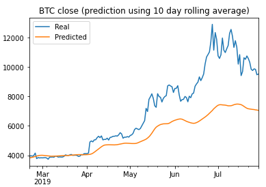
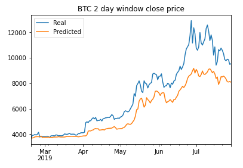
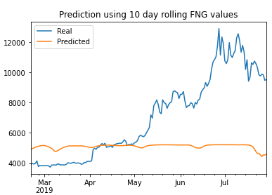
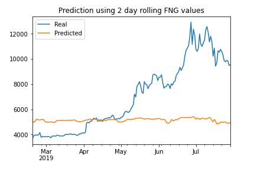

# LSTM Bitcoin price predictor
Unit 14 Homework - Deep Learning

In this homework, I built and compared two deep learning models: one using FNG values (Crypto Fear and Greed Index) and another using the Bitcoin closing price to see which indicator can predict Bitcoin prices better. To get the prediction, I used an LSTM recurrent neural network which uses a rolling average of a specified window for each indicator. For both models, the data was divided into 70% training data and 30% test data and scaled.

### BTC prediction using BTC close price of previous days

I initially used a 10 day rolling window of previous BTC close prices to predict BTC prices. There are 3 hidden layers , with a dropout fraction of 0.2. Batch size is 1 and epochs is 10. With these features, I got a loss of .0502

Then I tried using a 2 day rolling average and it seemed to have improved the prediction significantly. Loss was at .0231. It can also be seen from the plot below that the 2 day rolling average price is closer to the actual price.

### BTC prediction using FNG values of previous days

In this section, I used the 10 day rolling average of FNG values with same model features (3 hidden layers, dropout fraction of 0.2, batch size of 1 and 10 epochs) to predict BTC close prices. The loss in this model was 0.1183

Similar to the section above, I then tried using a 2 day rollling average of FNG values with the same model features to predict BTC close prices. This moved the loss ever so slightly to 0.1138.

### Comparing the results

1. **Which model has a lower loss?**  
The model using BTC close prices showed lower loss results compared to the model using FNG values.

2. **Which model tracks the actual values better over time?**  
Based on the plots shown above, BTC closing prices tracks actual values over time much better than FNG values. 

3. **Which window size works best for the model?**  
For my analysis, I tested the windows 10, 5 and 2. The 2 day rolling window was the model that had the lowest loss and also the closest predictions. For the FNG values, reducing the window from 10 to 2 improved the model but only very slightly. The FNG values did not seem to track the actual values at all. 

### Jupyter Notebook files

[LSTM RNN BTC 10 day window](https://github.com/nikanikachan/HW14_DeepLearning/blob/main/lstm_stock_predictor_closing.ipynb)

[LSTM RNN BTC 2 day window](https://github.com/nikanikachan/HW14_DeepLearning/blob/main/lstm_stock_predictor_closing_2daywindow.ipynb)

[LSTM RNN FNG 10 day window](https://github.com/nikanikachan/HW14_DeepLearning/blob/main/lstm_stock_predictor_fng.ipynb)

[LSTM RNN FNG 2 day window](https://github.com/nikanikachan/HW14_DeepLearning/blob/main/lstm_stock_predictor_fng_2daywindow.ipynb)
